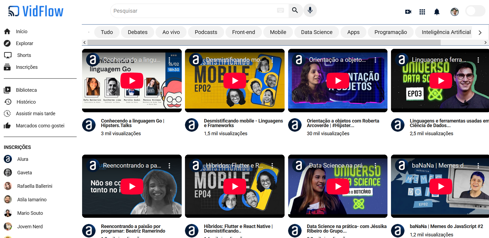
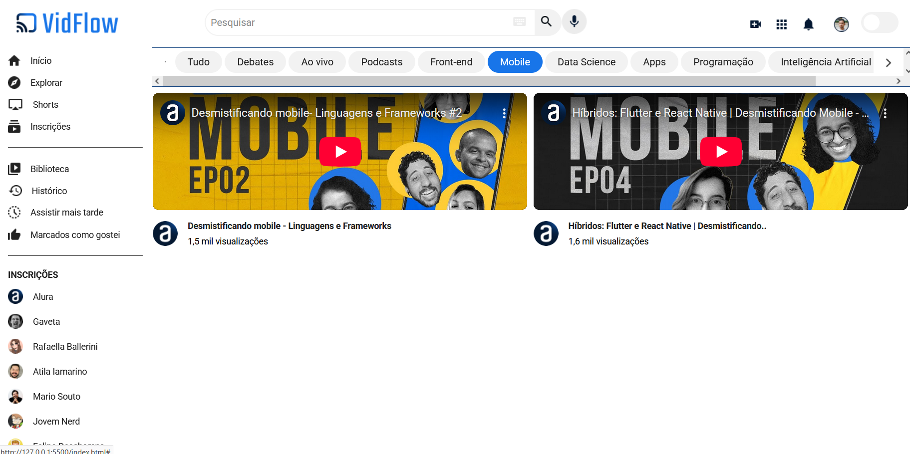
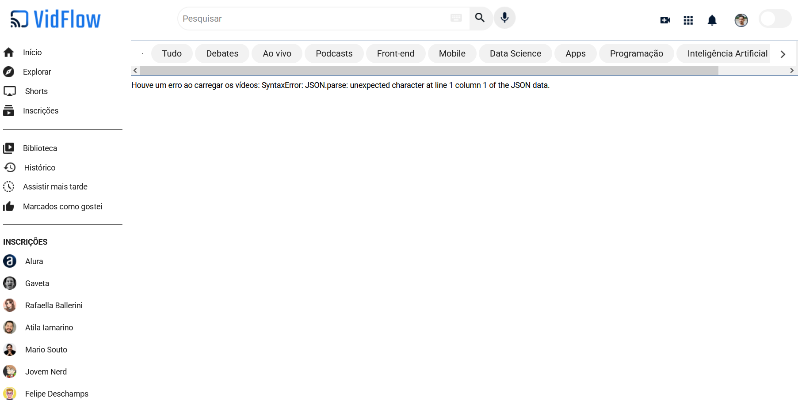

# 🎥 VidFlow

**VidFlow** é uma plataforma de compartilhamento de vídeos desenvolvida como parte do curso **"JavaScript: consumindo e tratando dados de uma API"** da Alura. A aplicação simula uma plataforma funcional com navegação no topo e na lateral, exibição de vídeos, filtros por busca e categoria, e tratamento de erros.

 

## 🚀 Sobre o Projeto

Este projeto foi desenvolvido durante o curso da Alura:

* "JavaScript: consumindo e tratando dados de uma API"

O objetivo foi aplicar conceitos de **requisições assíncronas, manipulação de dados via JavaScript e consumo de uma API simulada**, além da implementação de **filtros dinâmicos** e tratamento de erros.
  
## 📚 Objetivos do Curso

* Aprender a **consumir uma API** com JavaScript;
* Criar **filtros dinâmicos** para os dados da API;
* Fazer a tradução de um layout predefinido em uma aplicação funcional;
* Utilizar **async await** para criar **funções assíncronas**;
* Construir uma plataforma de compartilhamento de vídeos;
* Conhecer as **Promises** e seus métodos;
* **Tratar possíveis erros** de requisição retornados da API.

## 🛠️ Tecnologias Utilizadas

                                

## 🖼️ Visualização do Projeto

Uma prévia das principais telas do **Vidflow**:

**🌐 Acesse o Projeto Online**

O projeto está disponível para visualização na **Vercel**. Clique no link abaixo para acessar:

**🎞️ Tela Inicial com Vídeos**

Visualização da galeria de vídeos centralizada.

**🔍 Filtro por Categoria**

Exemplo de filtragem dinâmica ao selecionar a categoria Mobile.

**🚫 Tratamento de Erros**

Exemplo de exibição de mensagem amigável ao usuário caso haja erro na requisição da API.

